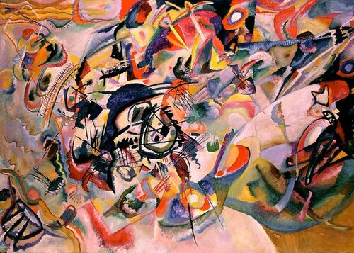
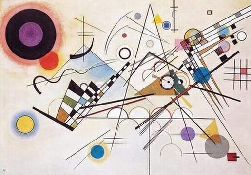

## Motivational Marginalia

It took Wassily Kandinsky 10 years for transitioning "from the apocalyptic emotion of Composition VII to the geometric rhythm of Composition VIII." [1] (which is used as the book cover) 

Be patient!

[Composition VII](https://www.wassilykandinsky.net/work-36.php)

 

[Composition VIII](https://www.wassilykandinsky.net/work-50.php)

## References

[1] [wassilykandinsky.net](https://www.wassilykandinsky.net/work-50.php)