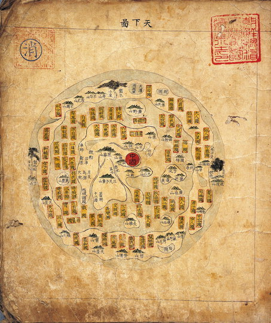

## Motivational Marginalia

It took Wassily Kandinsky 10 years for transitioning "from the apocalyptic emotion of Composition VII to the geometric rhythm of Composition VIII." [1] (which is used as the book cover) 

Be patient!

[Composition VII](https://www.wassilykandinsky.net/work-36.php)

 

[Composition VIII](https://www.wassilykandinsky.net/work-50.php)

## Chapter 1: Maps are models - an ancient Chinese Map

The following picture of an acient Chinese map appears in Chapter 1. Here is a colored version [2].

 

### Understanding the "model"

The inner red circle represents China - 中國. 

According to a Korean source (translated with Google translator):
> On this map, trees are drawn to indicate the directions of the northeast, west, and north. Continents and coastlines are shown with thin lines, and many names of countries are also written. [2]

Quoting another source:
> This mid-1700s Chinese map of the world features an inner continent surrounded by a sea holding fantasy lands and mountains, themselves surrounded by a fictional outer ring of land. The trees to the far east and west mark the areas from which the sun and moon were assumed to rise and set. Data on the mythical lands was drawn from the Shanhai jing, a collection of Chinese myths and fables dating back to the 4th century B.C. [3]

## Chapter 2: A poet is made, not born

An excerpt from the poem "Poeta Fit, Non Nascitur" by the famous creator of "Alice's Adventures in Wonderland" - Lewis Caroll - introduces the chapter on ubiquitous language. 

> For first you write a sentence,
> 
> And then you chop it small;
> 
> Then mix the bits, and sort them out
> 
> Just as they chance to fall:
> 
> The order of the phrases makes
> 
> No difference at all.

[Here](http://www.online-literature.com/carroll/2822/) you can find the complete poem.

## Chapter 3: A medieval sky computer

"The astrolabe, used to compute star positions, is a mechanical implementation of a model of the sky" p.47

For those, who might wonder, how an atrolabe works, this TED talk may enlighten you. [Tom Wujec demos the 13th-century astrolabe](https://www.youtube.com/watch?v=yioZhHe1i5M)

## References

[1] [wassilykandinsky.net](https://www.wassilykandinsky.net/work-50.php)

[2] [Science within non-science](https://dl.dongascience.com/magazine/view/S199101N039)

[3] [25 Ancient Maps That Make Modern Ones Look Very Boring](http://amorq.com/article/3094/25-ancient-maps-that-make-modern-ones-look-very-boring)