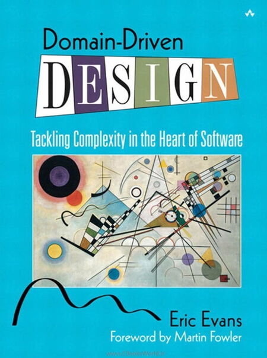

# Reading the 'Blue Book' - Domain-Driven Design (Eric Evans) / Tackling Complexity in the Heart of Software

Let's study the "(Big) Blue Book" together!

## About the book
"This book belongs on the shelf of every thoughtful Software developer" - Kent Beck

Eric Evans' Domain Driven Design[^1] is a classic for a reason. It is a book filled with insights and knowledge that has significantly influenced the thinking about modelling software. Yet, it's been a while since it was written - this year marks the 20th anniversary (!) - , some techniques have been refined since.
That is why we think it is the perfect choice for a study group, where we can deepen our understanding and share our experiences. Whether you're new to DDD or have been practicing it for years, there is (still) wisdom to be found in the blue book.

## Join us on this endeavor
The first session will be about getting to know each other and sharing hopes and expectations for the study group. We recommend reading the foreword and preface before the meeting. Our plan is to read the entire book (again) along a defined schedule that proposes chapters for a bi-weekly meetings to discuss takeaways, questions and ideas.

We're looking forward to meeting you!

**Meetup:** https://www.meetup.com/coders-only/events/291161464?utm_medium=referral&utm_campaign=share-btn_savedevents_share_modal&utm_source=link

You can also join our Discord Channel at https://discord.gg/Gykr6b5QBK

[^1]: [Domain-Driven Design: Tackling Complexity in the Heart of Software by Eric Evans / Publisher: Addison-Wesley / ISBN: 0-321-12521-5](https://www.dddcommunity.org/book/evans_2003/)

---

###  [Marginalia](./MARGINALIA.md)  

---

## The Chapters / Lectures schedule
### Monday, 27-02-2023 - Preface & Forward 

| Chapter           | Keywords | Pages / Count |
| ----------------- | -------- | ------------: |
| Preface & Forward |          |             ? |

---

### Monday, 13-03-2023 - Chapter 1 and 2

| Chapter                                  | Keywords            | Pages / Count |
| ---------------------------------------- | ------------------- | ------------: |
| 1. Crunching Knowledge                   |                     |   1 - 22 (21) |
| 2. Communication and the Use of Language | UBIQUITOUS LANGUAGE |  23 - 44 (21) |

Additional Content: 
1. Watch the first 10 minutes of https://www.youtube.com/watch?v=am-HXycfalo to understand bounded contexts.
2. Marginalia: [More on the Chinese Map from chapter 1](https://github.com/sabinewinkler/ddd-blue-book-study/blob/main/MARGINALIA.md#chapter-1-maps-are-models---an-ancient-chinese-map)
3. Marginalia: [A poet is made, not born](https://github.com/sabinewinkler/ddd-blue-book-study/blob/main/MARGINALIA.md#chapter-2-a-poet-is-made,-not-born)

Further links regarding knowledge crunching techniques:
* [Event Storming](https://www.eventstorming.com/) / an introductionary video on [youtube](https://www.youtube.com/watch?v=fGm62ra_mQ8)
* [Domain Storytelling](https://domainstorytelling.org/)

---

### Monday, 27-03-2023 - Chapter 3 and 4

| Chapter                             | Keywords             | Pages / Count |
| ----------------------------------- | -------------------- | ------------: |
| 3. Binding Model and Implementation | MODEL-DRIVEN DESIGN  |  45 - 62 (16) |
| 4. Isolating the Domain             | LAYERED ARCHITECTURE |  63 - 80 (17) |

Additional Content: 
1. [Scott Wlaschin - Domain Modeling Made Functional](https://www.youtube.com/watch?v=PLFl95c-IiU)
2. [Ian Cooper on Clean Architecture](https://youtu.be/SxJPQ5qXisw)
3. If you even want to go deeper [Alistair Cockburn - Hexagonical Architecture](https://alistair.cockburn.us/hexagonal-architecture/)
4. Marginalia: [A medieval sky computer](https://github.com/sabinewinkler/ddd-blue-book-study/blob/main/MARGINALIA.md#chapter-3-a-medieval-sky-computer)
---

**Attention: Easter Monday, 10-04-2023, will be skipped!**

---

### Monday, 17-04-2023 - Chapter 5

| Chapter                          | Keywords                                                  | Pages / Count |
| -------------------------------- | --------------------------------------------------------- | ------------: |
| 5. A Model Expressed in Software | ENTITIES,   VALUE OBJECTS,   SERVICES,   MODULES | 81 - 122 (41) |

---

**Attention: May Day Monday, 01-05-2023, will be skipped!**

---

### Monday, 08-05-2023 - Chapter 6 

| Chapter                              | Keywords                                     |  Pages / Count |
| ------------------------------------ | -------------------------------------------- | -------------: |
| 6. The Life Cycle of a Domain Object | AGGREGATES,   FACTORIES,  REPOSITORIES | 123 - 162 (39) |

---

### Monday, 22-05-2023 - Chapter 7 and Chapter 8

| Chapter                                    | Keywords |  Pages / Count |
| ------------------------------------------ | -------- | -------------: |
| 7. Using the Language: An Extended Example |          | 163 - 186 (23) |
| 8. Breakthrough                            |          | 187 - 204 (27) |

---

### Monday, 05-06-2023 -  Chapter 9 

| Chapter                              | Keywords      |  Pages / Count |
| ------------------------------------ | ------------- | -------------: |
| 9. Making Implicit Concepts Explicit | SPECIFICATION | 205 - 242 (37) |

---

### Monday, 19-06-2023 - Chapter 10

| Chapter           | Keywords                                                                                                                                                                  |  Pages / Count |
| ----------------- | ------------------------------------------------------------------------------------------------------------------------------------------------------------------------- | -------------: |
| 10. Supple Design | INTENTION-REVEALING INTERFACES,   SIDE-EFFECT-FREE FUNCTIONS,   ASSERTIONS,   CONCEPTUAL CONTOURS,   STANDALONE STANDALONE CLASSES,  CLOSURE OF OPERATIONS | 243 - 292 (49) |

---

### Monday, 03-07-2023 - Chapter 11, 12, 13

| Chapter                                   | Keywords                                            |  Pages / Count |
| ----------------------------------------- | --------------------------------------------------- | -------------: |
| 11. Applying Analysis Patterns            |                                                     | 293 - 308 (15) |
| 12. Relating Design Patterns to the Model | STRATEGY (A.K.A. POLICY), COMPOSITE,  FLYWEIGHT? | 309 - 320 (11) |
| 13. Refactoring Toward Deeper Insight     |                                                     | 321 - 326 (15) |

---

### Monday, 24-07-2023 - Chapter 14

| Chapter                         | Keywords                                                                                                                                                                                                                                    |          Pages |
| ------------------------------- | ------------------------------------------------------------------------------------------------------------------------------------------------------------------------------------------------------------------------------------------- | -------------: |
| 14. Maintaining Model Integrity | BOUNDED CONTEXT,   CONTINUOUS  INTEGRATION,  CONTEXT MAP, SHARED KERNEL,   CUSTOMER/SUPPLIER DEVELOPMENT TEAMS,  CONFORMIST,  ANTICORRUPTION LAYER,  SEPARATE WAYS,   OPEN HOST SERVICE,   PUBLISHED LANGUAGE | 327 - 396 (59) |

---

### Monday, 31-07-2023 - Chapter 14 (Follow-up)

| Chapter                         | Keywords                                                                                                                                                                                                                                    |          Pages |
| ------------------------------- | ------------------------------------------------------------------------------------------------------------------------------------------------------------------------------------------------------------------------------------------- | -------------: |
| 14. Maintaining Model Integrity | BOUNDED CONTEXT,   CONTINUOUS  INTEGRATION,  CONTEXT MAP, SHARED KERNEL,   CUSTOMER/SUPPLIER DEVELOPMENT TEAMS,  CONFORMIST,  ANTICORRUPTION LAYER,  SEPARATE WAYS,   OPEN HOST SERVICE,   PUBLISHED LANGUAGE | 327 - 396 (59) |

It might be helpful to have a short look at CORE DOMAIN (part of chapter 15.)

---

### Monday, 14-08-2023 - Chapter 15 (Summer holidays)

| Chapter          | Keywords                                                                                                                                                 |          Pages |
| ---------------- | -------------------------------------------------------------------------------------------------------------------------------------------------------- | -------------: |
| 15. Distillation | CORE DOMAIN,   GENERIC SUBDOMAINS,  DOMAIN VISION STATEMENT,  HIGHLIGHTED COKE,  COHESIVE MECHANISMS,  SEGREGATED CORE,  ABSTRACT CORE | 397 - 438 (41) |

---

### Monday, 28-08-2023 - Chapter 16 (Summer holidays)

| Chapter                   | Keywords                                                                                                               |          Pages |
| ------------------------- | ---------------------------------------------------------------------------------------------------------------------- | -------------: |
| 16. Large-Scale Structure | EVOLVING ORDER,  SYSTEM METAPHOR,  RESPONSIBILITY LAYERS,  KNOWLEDGE LEVEL,  PLUGGABLE COMPONENT FRAMEWORK | 439 - 484 (45) |

---

### TBD: "Final Biergarten session" - Chapter 17, Conclusion

| Chapter                            | Keywords |          Pages |
| ---------------------------------- | -------- | -------------: |
| 17. Bringing the Strategy Together |          | 485 - 498 (13) |
| Conclusion                         |          |  499 - 507 (8) |

